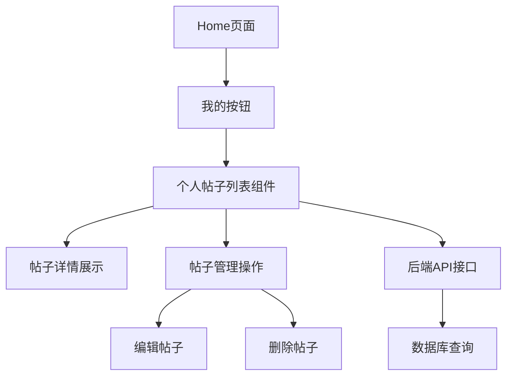

## 产品概述

在失物招领系统的首页头像左侧添加"我的"按钮，点击后在当前页面展示用户发布的帖子列表，支持查看和管理个人帖子。

## 核心功能

- 在home页面头像左侧添加"我的"按钮
- 点击按钮后展示用户发布的帖子列表
- 支持查看个人帖子详情
- 提供基本的帖子管理功能（编辑、删除）
- 保持与现有UI风格一致的界面设计

## 技术栈

基于现有项目技术栈进行扩展：

- 前端框架：复用现有前端技术栈
- 后端API：扩展现有用户和帖子相关接口
- 数据库：利用现有用户和帖子数据表

## 技术架构

### 系统架构

基于现有项目架构，在用户界面层和数据访问层之间添加个人帖子管理模块。



### 模块划分

- **UI组件模块**：我的按钮组件、个人帖子列表组件
- **数据服务模块**：个人帖子查询接口、帖子管理接口
- **状态管理模块**：个人帖子数据状态管理

### 数据流

用户点击"我的"按钮 → 调用个人帖子查询接口 → 获取用户发布的帖子数据 → 渲染帖子列表 → 支持查看详情和管理操作

## 实现细节

### 核心目录结构

基于现有项目结构，只显示新增或修改的文件：

```
project-root/
├── src/
│   ├── components/
│   │   ├── MyPostsButton.jsx     # 新增：我的按钮组件
│   │   └── MyPostsList.jsx       # 新增：个人帖子列表组件
│   ├── pages/
│   │   └── Home.jsx              # 修改：添加我的按钮
│   └── services/
│       └── userPostsService.js   # 新增：个人帖子服务
```

### 关键代码结构

**个人帖子数据接口**：定义用户个人帖子的数据结构和查询接口

```javascript
// 个人帖子查询服务
class UserPostsService {
  async getUserPosts(userId) { }
  async deleteUserPost(postId) { }
  async updateUserPost(postId, data) { }
}
```

### 技术实现方案

1. **按钮集成**：在Home页面头像左侧添加"我的"按钮
2. **数据获取**：创建个人帖子查询接口，基于当前登录用户ID获取帖子
3. **列表展示**：设计个人帖子列表组件，支持分页和搜索
4. **管理功能**：提供编辑和删除操作，复用现有帖子编辑组件

### 集成要点

- 复用现有的用户认证系统获取当前用户信息
- 利用现有的帖子数据模型和API接口
- 保持与现有UI组件的设计风格一致
- 确保与现有路由和状态管理系统兼容

## Agent Extensions

### MCP

- **repomind**
- 目的：分析现有项目结构，了解用户系统、帖子管理和前端组件的实现方式
- 预期结果：获取项目架构信息，定位相关文件和接口，为功能集成提供技术基础

### SubAgent  

- **code-explorer**
- 目的：深入探索现有的用户认证、帖子管理和UI组件代码
- 预期结果：理解现有代码结构和实现模式，确保新功能与现有系统无缝集成